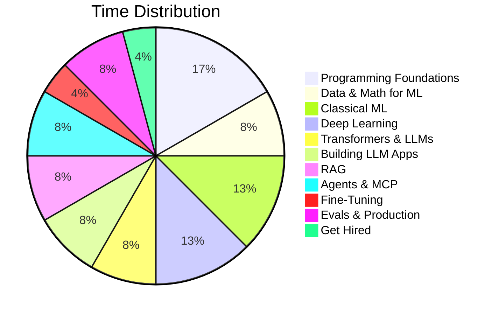

<div align="center">


# 🐍 Zero to AI Engineer

### *A 24-week roadmap from your first line of Python to deployed LLM apps, RAG systems & agents.*

---


[](https://md-mamun-00.github.io/zero-to-AI-engineer/)

[](https://github.com/Md-Mamun-00/zero-to-AI-engineer/stargazers)
[](https://github.com/Md-Mamun-00/zero-to-AI-engineer/network/members)


</div>

---

## 📖 The Problem

> Most AI engineer roadmaps are just walls of text. You read them, bookmark them, and never start.
> There's no progress tracking, no structure, and no motivation to keep going.

**Zero to AI Engineer** fixes this with a **Duolingo-style interactive path** — click a week, learn step by step, track your progress, and ship real projects.

---

## 🎯 What You Get

<table>
<tr>
<td width="50%">

### 🗺️ Interactive Roadmap
- **24 weeks** of structured learning
- Click any unlocked week to start
- Step-by-step resource flow
- Progress saved in your browser

</td>
<td width="50%">

### 🐍 Meet the Mascot
- **15 unique poses** for different states
- Celebrates your milestones
- Guides you through the journey
- Makes learning fun

</td>
</tr>
<tr>
<td>

### 🌐 Language Toggle
- **English** resources by default
- **Hindi** alternatives available
- Filter by your preference

</td>
<td>

### 📊 Progress Tracking
- XP system (50 per week, 100 per project)
- Streak counter
- Phase completion celebrations
- Confetti on milestones 🎉

</td>
</tr>
</table>

---

## 🗺️ The Roadmap

```mermaid
graph TD
    subgraph Phase1["🔤 Phase 1: Programming Foundations"]
        W1[Week 1: Python Basics] --> W2[Week 2: Python for Real Work]
        W2 --> W3[Week 3: Git, Terminal & SQL]
        W3 --> W4[Week 4: APIs & Tiny Backend]
    end

    subgraph Phase2["📊 Phase 2: Data & Math for ML"]
        W5[Week 5: NumPy, Pandas & Plots] --> W6[Week 6: The Math You Actually Need]
    end

    subgraph Phase3["🤖 Phase 3: Classical ML"]
        W7[Week 7: How Machines Learn] --> W8[Week 8: Trees, Ensembles & Clustering]
        W8 --> W9[Week 9: End-to-End ML Project]
    end

    subgraph Phase4["🧠 Phase 4: Deep Learning"]
        W10[Week 10: Neural Nets from Scratch] --> W11[Week 11: PyTorch Fundamentals]
        W11 --> W12[Week 12: CNNs & Transfer Learning]
    end

    subgraph Phase5["💬 Phase 5: Transformers & LLMs"]
        W13[Week 13: Attention & Transformers] --> W14[Week 14: How LLMs Are Built]
    end

    subgraph Phase6["🔧 Phase 6: Building LLM Apps"]
        W15[Week 15: LLM APIs & Prompting] --> W16[Week 16: Structured Output & Tools]
    end

    subgraph Phase7["🔍 Phase 7: RAG"]
        W17[Week 17: Embeddings & Vector Search] --> W18[Week 18: Better Retrieval & Evals]
    end

    subgraph Phase8["🤖 Phase 8: Agents & MCP"]
        W19[Week 19: Agent Fundamentals] --> W20[Week 20: MCP & Multi-Agent]
    end

    subgraph Phase9["⚙️ Phase 9: Fine-Tuning"]
        W21[Week 21: Fine-Tuning When It Pays]
    end

    subgraph Phase10["🚀 Phase 10: Evals & Production"]
        W22[Week 22: Evals, Tracing & Security] --> W23[Week 23: Ship to Production]
    end

    subgraph Phase11["💼 Phase 11: Get Hired"]
        W24[Week 24: Portfolio & Job Hunt]
    end

    W4 --> W5
    W6 --> W7
    W9 --> W10
    W12 --> W13
    W14 --> W15
    W16 --> W17
    W18 --> W19
    W20 --> W21
    W21 --> W22
    W23 --> W24

    style Phase1 fill:#1cb0f6,stroke:#1899d6,color:#fff
    style Phase2 fill:#ce82ff,stroke:#a568d1,color:#fff
    style Phase3 fill:#ce82ff,stroke:#a568d1,color:#fff
    style Phase4 fill:#ff4b4b,stroke:#ea2b2b,color:#fff
    style Phase5 fill:#ff4b4b,stroke:#ea2b2b,color:#fff
    style Phase6 fill:#ff9600,stroke:#e08600,color:#fff
    style Phase7 fill:#ffc800,stroke:#e0aa00,color:#000
    style Phase8 fill:#58cc02,stroke:#4baf02,color:#fff
    style Phase9 fill:#1cb0f6,stroke:#1899d6,color:#fff
    style Phase10 fill:#37464f,stroke:#232f35,color:#fff
    style Phase11 fill:#ff4b4b,stroke:#ea2b2b,color:#fff
```



---

## 🚀 How the Week Flow Works

```mermaid
flowchart LR
    A[Click Week Node] --> B[Full Page View]
    B --> C{Language Toggle}
    C -->|English| D[Main Steps]
    C -->|Hindi| D
    C -->|All| D
    D --> E[Step 1: Open Resource]
    E --> F[New Tab Opens]
    F --> G[Come Back]
    G --> H[Click Continue]
    H --> I[Step 2: Next Resource]
    I --> J[... More Steps]
    J --> K[Supplementary Section]
    K --> L[Practice & Build]
    L --> M[Mark Week Complete]
    M --> N[Confetti! 🎉]
    N --> O[Back to Path]

    style A fill:#58cc02,stroke:#4baf02,color:#fff
    style M fill:#ffc800,stroke:#e0aa00,color:#000
    style N fill:#ff4b4b,stroke:#ea2b2b,color:#fff
```



---

## 📁 Project Structure

```
zero-to-AI-engineer/
├── index.html              # Main HTML shell
├── data.js                 # 🎯 Edit this to change content
├── app.js                  # All application logic
├── style.css               # All styles (Duolingo-inspired)
├── assets/
│   └── mascots/            # 15 mascot poses + logo
│       ├── 01_excited_welcome.png
│       ├── 02_reading_book.png
│       ├── 03_graduation_phase_complete.png
│       ├── 04_on_laptop_shipping.png
│       ├── 05_heart_eyes_path_complete.png
│       ├── 06_question_mark_locked.png
│       ├── 07_lightbulb_tip.png
│       ├── 08_cheering_week_complete.png
│       ├── 09_sweating_writing_notes.png
│       ├── 10_sleepy_locked_streak.png
│       ├── 11_on_fire_streak.png
│       ├── 12_sunglasses_cool_capstone.png
│       ├── 13_hatching_egg_week1.png
│       ├── 14_speech_bubble_resource_tip.png
│       ├── 15_waving_header_logo.png
│       └── logo.png
└── README.md
```

---

## 🎨 Features

| Feature | Description |
|---------|-------------|
| 🗺️ **Interactive Path** | Zigzag path with 24 clickable week nodes |
| 🐍 **Mascot System** | 15 unique poses for different states |
| 📊 **Progress Tracking** | XP, streaks, phase completion |
| 🌐 **Language Toggle** | English / Hindi / All filter |
| 📱 **Mobile First** | Works on any device |
| 🌙 **Dark/Light Theme** | Toggle with one click |
| 💾 **Offline Ready** | Progress saved in localStorage |
| 🎉 **Celebrations** | Confetti on milestones |
| 📝 **Step-by-Step** | One resource at a time |
| 🔗 **External Links** | Opens in new tab, come back to continue |

---

## 🛠️ Tech Stack

<table>
<tr>
<td>

**Frontend**
- Pure HTML5
- CSS3 (Custom Properties)
- Vanilla JavaScript (ES5)
- No frameworks, no dependencies

</td>
<td>

**Design**
- Duolingo-inspired UI
- Custom SVG icons
- Nunito font (Google Fonts)
- CSS animations

</td>
<td>

**Data**
- JSON-based content
- Separate data.js file
- Easy to edit and extend
- No build step needed

</td>
</tr>
</table>

---

## 🚀 Quick Start

```bash
# Clone the repo
git clone https://github.com/Md-Mamun-00/zero-to-AI-engineer.git

# Go to the folder
cd zero-to-AI-engineer

# Open with any server
# Option 1: VS Code Live Server
# Option 2: Python
python -m http.server 8000

# Option 3: Node.js
npx serve .

# Then open http://localhost:8000
```

---

## 📝 How to Edit Content

All roadmap data lives in **`data.js`**. You don't need to touch HTML, CSS, or JS.

### Adding a New Week

```javascript
// In data.js, find the phase and add a week:
{
  n: 25,
  title: "Your New Week",
  topics: ["Topic 1", "Topic 2", "Topic 3"],
  ship: "Your ship task description.",
  steps: [
    {
      id: "s_new_1",
      type: "COURSE",
      title: "Course Title",
      meta: "Provider · Duration",
      desc: "Course description.",
      url: "https://example.com",
      lang: "en",
      stream: "main"
    }
  ]
}
```

### Step Stream Types

| Stream | Description |
|--------|-------------|
| `main` | Core learning path (shown sequentially) |
| `supplementary` | Optional books/docs (collapsible section) |
| `practice` | Practice exercises (shown at end) |

### Step Language Tags

| Lang | Description |
|------|-------------|
| `en` | English resource |
| `hi` | Hindi resource |

---

## 🐍 Mascot Guide

| # | Mascot | When Shown |
|---|--------|------------|
| 01 | Excited (sparkles) | START badge, new lesson unlocked |
| 02 | Reading book | Inside lesson modal, topics list |
| 03 | Graduation cap | Phase complete celebration |
| 04 | On laptop | Ship task callout |
| 05 | Heart eyes | 100% path complete |
| 06 | Question mark | Locked node tooltip |
| 07 | Lightbulb | Pitfall/tip cards |
| 08 | Cheering | Mark week complete |
| 09 | Sweating | Hard phases (9, 10) |
| 10 | Sleepy | No streak today |
| 11 | On fire | Streak counter |
| 12 | Sunglasses | Capstone/Week 24 |
| 13 | Hatching egg | Week 1 / Day 0 |
| 14 | Speech bubble | Resource cards |
| 15 | Waving | Header logo |

---

## 📊 Roadmap at a Glance



---

## 🤝 Contributing

Contributions are welcome! Here's how:

1. **Fork** the repository
2. **Create** a feature branch (`git checkout -b feature/amazing`)
3. **Edit** `data.js` to add content
4. **Commit** your changes (`git commit -m 'Add amazing feature'`)
5. **Push** to the branch (`git push origin feature/amazing`)
6. **Open** a Pull Request

---

## 📄 License

This project is licensed under the **MIT License** — see the [LICENSE](LICENSE) file for details.

---

## 🙏 Acknowledgments

- **Duolingo** — for the UI/UX inspiration
- **Andrej Karpathy** — for the incredible AI education content
- **3Blue1Brown** — for making math visual
- **All the course creators** listed in the roadmap

---

<div align="center">


### *Start your AI engineering journey today.*

**[Begin the Roadmap →](https://md-mamun-00.github.io/zero-to-AI-engineer/)**

---

Made with ❤️ by [Md Mamun](https://github.com/Md-Mamun-00)


</div>